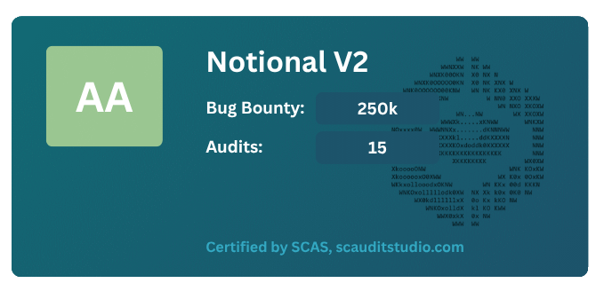

# SCAS Certificate

The following repository contains example implementations of SCAS certificates that can be embedded into any web application to display cybersecurity credentials and boost trust in your protocol.

## Integration

SCAS provides **four preset display options**:

* **2 Cards** – Detailed information with ratings, bug bounty amounts, and audit counts.
* **2 Banners** – Compact highlights for audit verification and security certification.

Each option is available as reusable HTML/CSS components located in the respective `cards/` and `banners/` folders of the repository.

### Step 1: Include Placeholder in Your HTML

Insert a placeholder `div` where you want to display the certificate:

```html
<div id="card-wrapper"></div>
```

### Step 2: Include Component Code

Copy the corresponding JavaScript and CSS files from the `cards/` or `banners/` folder into your web app.

Example for a card (e.g., “Excellent Cyber Security” card):

Copy `card-loader.js` from `/cards/stats`
Copy `card-style.css` from `/cards/stats`

```html
<link rel="stylesheet" href="path/to/card-style.css">
<script src="path/to/card-loader.js"></script>
```

The `card-loader.js` script dynamically injects the certificate UI into the specified div based on the rating (e.g., A, AA) or product (e.g., Aave V3, Notional V2).

### Step 3: Customize (Optional)

Each certificate comes with:

* **Security rating** (e.g., A, AA)
* **Bug bounty info**
* **Audit count**
* **Issuer and certification source**

You can configure these values directly in the HTML markup or via JavaScript options, depending on the implementation.

## Example


Example for a statistics card (e.g., “Excellent Cyber Security” card):

Copy `card-loader.js` from `/cards/stats`
Copy `card-style.css` from `/cards/stats`

```html
<link rel="stylesheet" href="path/to/card-style.css">
<script src="path/to/card-loader.js"></script>
```

---

## Certification

All components are **Certified by SCAS** and link to: [scauditstudio.com](https://scauditstudio.com)

To customize or verify certification, update the embedded `data-source` or hyperlink attributes accordingly.
